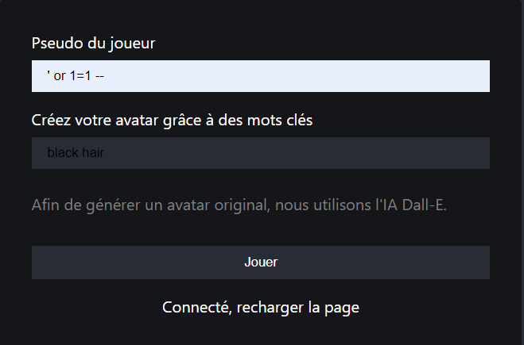
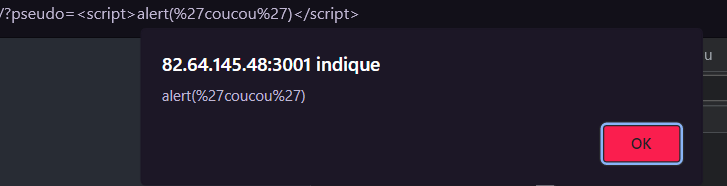
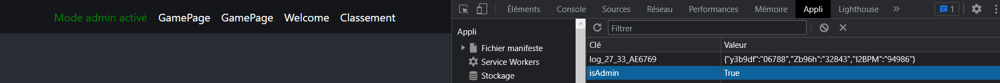
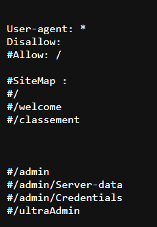
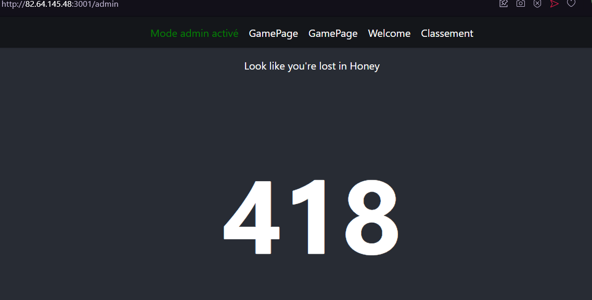
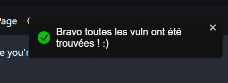

# Akaj2

## Bee The Hacker!
Les differentes vulnérabilités à trouver :

| Vuln | Aide  |
| ----------- | ----------- |
| Injection sql : sur la page Welcome lors d'une tentative d'une injection SQL |    |
| Injection XSS : lors de l'ajout d'un parametre avec les balises script | |
|Modification du parametre "isAdmin" dans le localStorage|   |
| Enumeration du site dans le chemin robots.txt avec chemin non sensible |     |
|Si toutes les vulnérabilités ont été trouvées une pop-pup s'affiche |  
|

